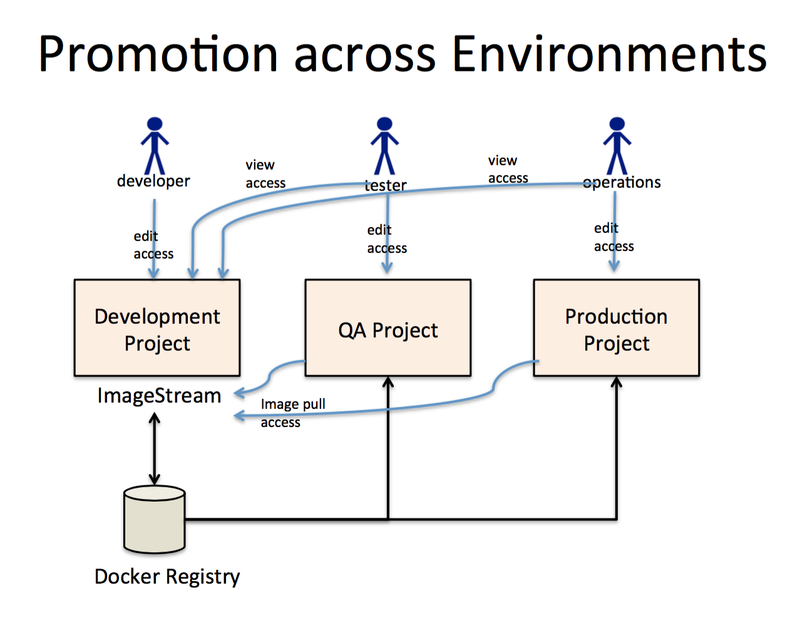

## OPENSHIFT PROMOTING APPLICATION ACROSS ENVIRONMENTS



### Application promotion means moving an application through various runtime environments, typically with an increasing level of maturity. For example, an application might start out in a development environment, then be promoted to a stage environment for further testing, before finally being promoted into a production environment. As changes are introduced in the application, again the changes will start in development and be promoted through stage and production

Create two new projects
```
oc new-project dev
oc new-project stage
```
if you are creating projects from admin user, provide edit access to the users who are going to use this project
I am using two users 1) developer 2) tester

developer is using project dev & tester is using project stage
oc adm policy add-role-to-user edit < username > -n < projectname >
```
oc adm policy add-role-to-user edit developer -n dev
oc adm policy add-role-to-user edit tester -n stage
```

provide view access to user tester to dev project

`oc adm policy add-role-to-user view tester -n dev`

provide image pull access to stage project from dev project, so it can pull images from dev project

`oc policy add-role-to-group system:image-puller system:serviceaccount:stage:default -n dev`

oc login to developer and create an application,

#### In this demo im using the TEMPLATE JBoss EAP 6.4 (no https) , git url is https://github.com/venatrix/jboss-eap-quickstarts.git  and the  application name is myapp

After creating myapp application check the images streams from dev project and tag the image stream with the tag :promote

Get the imagestream

`oc get is` 

you can see a image stream with the name `myapp`

describe the image stream

`oc describe is myapp`

copy the the imagestream name by copying the line starts with dokcer registry ip/ hostname.

`eg: 172.30.0.0:5000/dev/myapp@sha256:jdfnkjfne5wefef54ef5ef13f165f1`

tag the image stream with tag:promote

```
oc tag < image stream name > dev/myapp:promote
eg: oc tag 72.30.0.0:5000/dev/myapp@sha256:jdfnkjfne5wefef54ef5ef13f165f1 dev/myapp:promote
```

now login to tester
create application with the image:promote

```
oc login tester
oc new-app /dev/myapp:promote
```

If you are updating your build in myapp - dev project , it will create a new image stream for the new build , if you want pass the update image to teh tester - stage project

copy the updated imagesteam and the create tag :promote again

once the imgaestream with tag:promote is updated the stage project will start a new build automatically.


